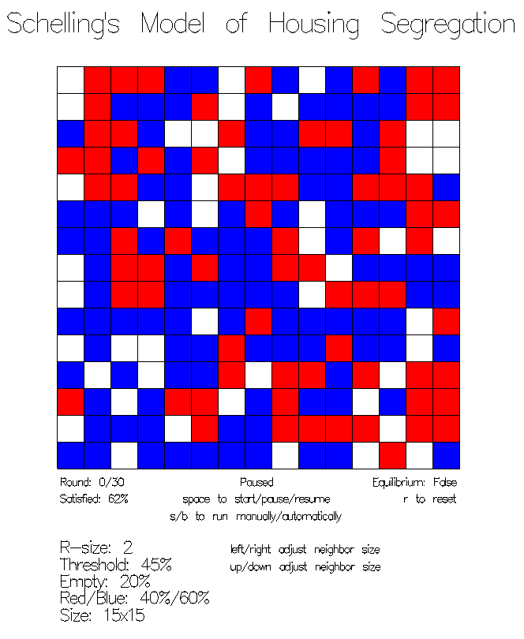

# Schelling's Model of Segregation

Lei Mao

University of Chicago

## Introduction

Racial and ethical segregation has been a social problem in the United States. To view such segregation, New York Times has collected data across the country and presented the data on the [map](http://www.nytimes.com/projects/census/2010/explorer.html?ref=censusbureau).

In 1971, the American economist [Thomas Schelling](https://en.wikipedia.org/wiki/Thomas_Schelling) proposed an agent-based [model](https://www.jstor.org/stable/1823701) to explain this phenomenon. One approach to implement Schelling's model of segregation is to use [cellular automata](http://nifty.stanford.edu/2014/mccown-schelling-model-segregation/).

In this project, a cellular automata based Schelling's model of segregation was implemented in Haskell.

<p align="center">
    
</p>

The red square is the house lived by red race, the blue square is the house lived by blue race, and the white square is the empty house. The algorithm details could be found [here](https://classes.cs.uchicago.edu/current/12100-1/pa/pa2/index.html).

## Dependencies

* GHC 8.4.2
* [Gloss 1.12.0.0](https://hackage.haskell.org/package/gloss)

## Files

```
.
├── Display.hs
├── Grid.hs
├── GridIO.hs
├── grid.txt
├── LICENSE.md
├── Main.hs
├── Makefile
├── README.md
├── Shuffle.hs
└── Simulation.hs
```


## Features

## Usage

### Installation

To install the program, run the following command in the terminal:

```bash
$ make
```

### Start Simlulation from Random State

To start simulation from random state, run the following command in the terminal:

```bash
$ ./Main max_steps grid_size red_percentage blue_percentage empty_percentage
```

* ``max_steps`` (integer) is the maximum number of steps the user wants to simulate. 
* ``grid_size`` (integer) is the number of rows/columns for the square grid (5 ≤ ``grid_size`` ≤ 15).
* ``red_percentage`` and ``blue_percentage`` (integer) are the percentage of race ratio of red and blue. The sum of these two numbers has to be 100 (0 ≤ ``red_percentage`` ≤ 100, 0 ≤ ``blue_percentage`` ≤ 100).
* ``empty_percentage`` (integer) is the percentage of empty houses on the grids (0 ≤ ``empty_percentage`` ≤ 100).


### Start Simlulation from Saved State

To start simulation from state saved in file, run the following command in the terminal:

```bash
$ ./Main max_steps grid.txt red_percentage blue_percentage empty_percentage
```
In this case, ``red_percentage``, ``blue_percentage``, and ``empty_percentage`` would be automatically inferred from ``grid.txt`` and the value user provided would not count.

The valid format for the file should look like the following:
```
NRows 
NCols 
DATA 
```
The first line should specify the number of rows in the grid (NRows).
The second line shoud specify the number of columns in the grie (NCols).
The third line (and beyond) will contains lines, where in each line (a row) should only contain "B", "R", or "O" (Empty) to represent the homeowners (i.e. columns). For each line, these homeowners values will be seperate by whitespace.

The following is an example of a valid grid configuration file:
```
10
10
R R O R R R R O R R
O B B B O O B B B O
R R R R B B B B O B
B B B O B B B B O B
B R R R O B B B O B
B R R R O R R O R R
B R R R O R R O R R
B R R R O R R O R R
B R R R O R R O R R
B R R R O R R O R R
```


## Notes

### Gloss Installation

To install Gloss, run the following commands in the terminal:

```bash
$ cabal update 
$ cabal install gloss 
```

### More Generalities

The program was implemented with consideration of rectangular rectangles and arbitrarily sized grids. This restrictions could be removed in the ``Main.hs`` file.

